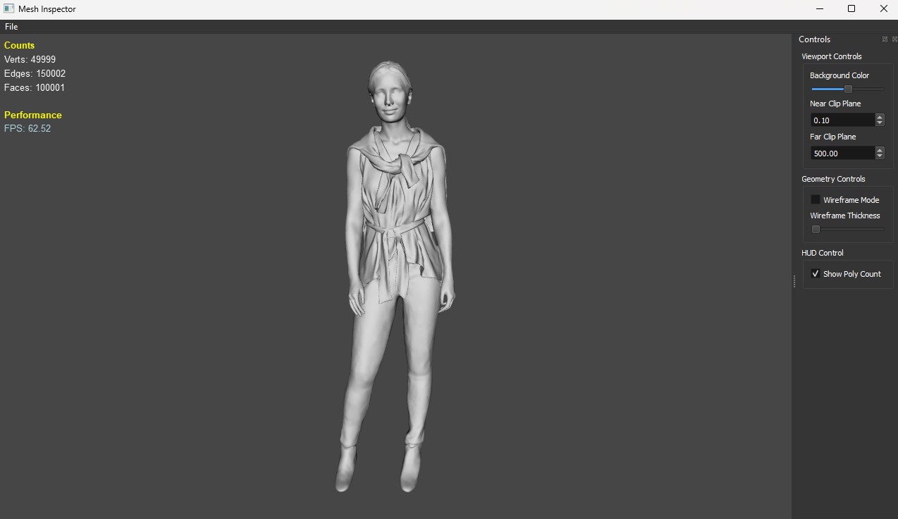

# Simple 3D Viewer

Simple 3D Viewer is a Python application that allows you to open and view OBJ models. It uses the PyOpenGL library to render the models and provides a user-friendly interface for navigating the 3D space.

## Features

- Load and view OBJ models
- Navigate the 3D space with controls based on Maya
- Toggle wireframe overlay on models
- Display a HUD for additional information

## Controls

- **W or 4**: Toggle wireframe overlay on models
- **H**: Display HUD
- **Alt + Left Mouse Button**: Rotate camera
- **Alt + Middle Mouse Button**: Pan camera
- **Alt + Right Mouse Button or Mouse Scroll**: Zoom camera

## Installation

1. Clone this repository
2. Install the required Python packages using pip:

```sh
pip install -r requirements.txt
```

3. Run the `main.py` script to start the application:

```sh
python main.py
```

## Screenshots

## Status

This project is currently a work in progress. More features and improvements are coming soon.
